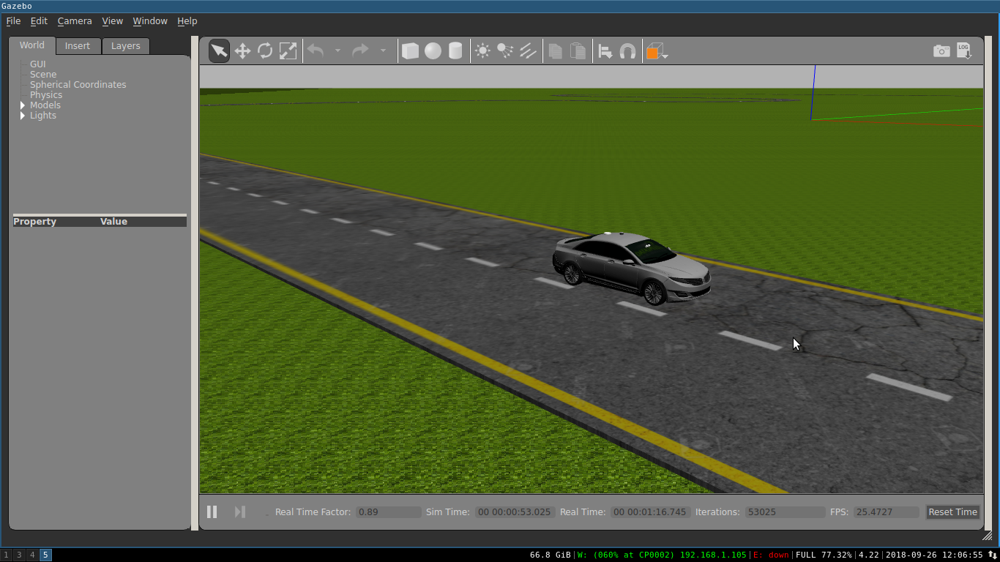

# ROS-car-autonomy

This project we are trying to make gazebo simulated car self-driving. Car i used is taken from dbw_mkz ros simulation. Images from the camera is taken and a CNN model is created and trained to predict steering and throttle output.

Requirements:
	-python2.7
	-ROS kinetic(Ubuntu 16.04)
	-DBW_MKZ simulation package
	-numpy
	-tensorflow
	-tflearn

This project was done on Ubuntu 16.04 and uses Tensorflow, tflearn, numpy and ROS kinetic.
The model is inspired from Alexnet model.

To install the car simulation.(more details about the simulator is given in the simulator_manual_v1_2_0.pdf)
1. bash <(wget -q -O - https://bitbucket.org/DataspeedInc/ros_binaries/raw/default/scripts/setup.bash)
2. sudo apt-get install ros-kinetic-dbw-mkz-simulator

An additional car.launch file was created for making our environment with simple road and car as given in the figure below.

For creating datasets we can use 'Dataset_creater.py'

